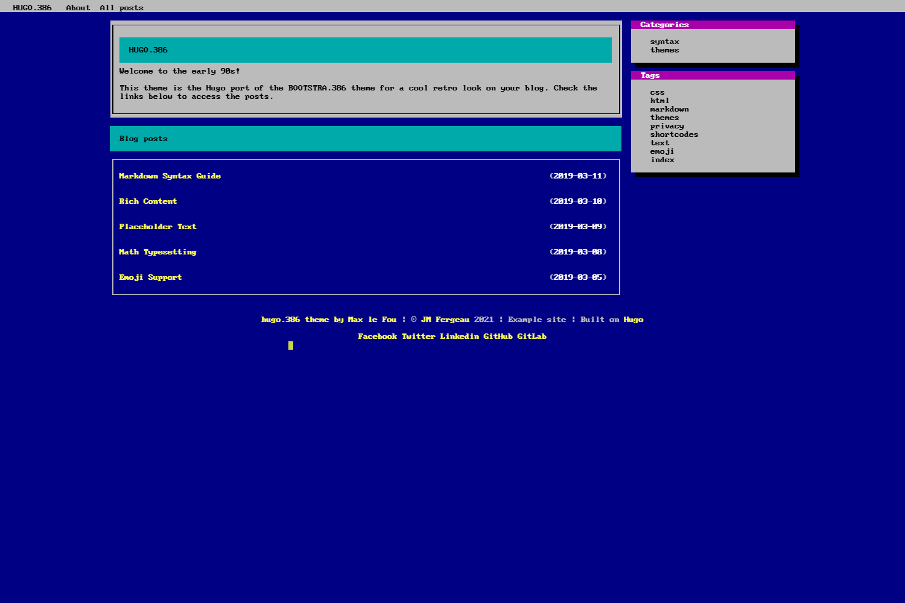

# HUGO.386
HUGO.386 is a port of the [BOOTSTRA.386](//github.com/kristopolous/BOOTSTRA.386) theme. It has a cool MS-DOS feeling and is ready to be used for blogs. Despite its antique look, the theme is responsive and can be viewed on mobile devices.

## [Test it on live here!](//maxlefou.gitlab.io/hugo.386-test/)

## Installation
Inside the folder of your Hugo site run:

    $ git submodule add https://gitlab.com/maxlefou/hugo.386 themes/hugo.386

For more information read the official [setup guide](//gohugo.io/overview/installing/) of Hugo.

## Getting started

After installing the theme successfully it requires a just a few more steps to get your site running.

### The config file

Take a look inside the [`exampleSite`](//gitlab.com/maxlefou/hugo.386/tree/master/exampleSite) folder of this theme. You'll find a file called [`config.toml`](//gitlab.com/maxlefou/hugo.386/blob/master/exampleSite/config.toml).
It contains detailed information about the customization of all strings in this theme. 

To use it, copy the [`config.toml`](//gitlab.com/maxlefou/hugo.386/blob/master/exampleSite/config.toml) in the root folder of your Hugo site. Feel free to change strings as you like.

### Nearly finished

In order to see your site in action, run Hugo's built-in local server. 

    $ hugo server

Now enter [`localhost:1313`](http://localhost:1313) in the address bar of your browser.

## Contributing

Did you found a bug or got an idea for a new feature? There's surely at least some subsisting glitches as this theme is brand new. So feel free to use the [issue tracker](//gitlab.com/maxlefou/hugo.386/issues) to let me know. Or make directly a [merge request](//gitlab.com/maxlefou/hugo.386/pulls).

## License

This theme is released under the Apache License 2.0 For more information read the [License](//github.com/digitalcraftsman/hugo-freelancer-theme/blob/master/LICENSE).

## Annotations

Thanks to [Steve Francia](//github.com/spf13) for creating Hugo and the awesome community around the project. Many thanks to [Kristopolous](//github.com/kristopolous) as well for the BOOTSRTA.386 theme, even if it's a bit outdated today. (and i'm not speaking of the retro look)